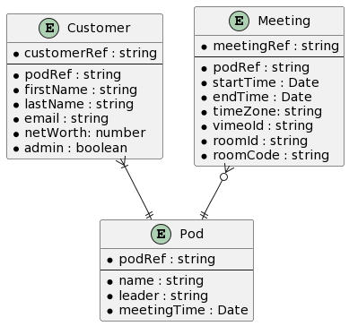
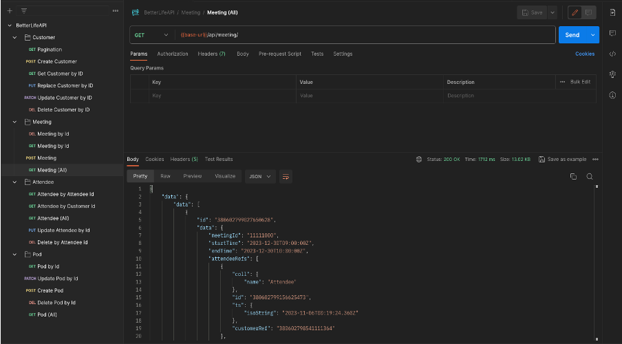

<p align="center">
  
<table align="center">
  <tr>
    <th>Team Member</th>
    <th>Contact Information</th>
  </tr>
  <tr>
    <td>Sparsh Saini</td>
    <td>sparshsaini@csus.edu</td>
  </tr>
  <tr>
    <td>Victor Severin</td>
    <td>victorseverin@csus.edu</td>
  </tr>
  <tr>
    <td>Brandon Chu</td>
    <td>brandonchu@csus.edu</td>
  </tr>
  <tr>
    <td>Daryl Denaga</td>
    <td>daryldenaga@csus.edu</td>
  </tr>
  <tr>
    <td>Fabian Lopez</td>
    <td>fabianlopez@csus.edu</td>
  </tr>
  <tr>
    <td>Jasjot Singh</td>
    <td>jasjotsingh@csus.edu</td>
  </tr>
  <tr>
    <td>Brian Lowery</td>
    <td>bdlowery@csus.edu</td>
  </tr>
  <tr>
    <td>Matt Christiansen</td>
    <td>mchristiansen@csus.edu</td>
  </tr>
</table>


# TribeMeet

<p align="center">
  
</p>

A component-based **web video conferencing application** that integrates with ABetterLife's existing software infrastructure and **resolves** compatibility issues, elevates the user experience, and delivers a robust API for detailed user analytics.  
Currently, ABetterLife uses a service called AirMeet to facilitate their weekly meetings however their customers have consistently had compatibility issues with different devices, cameras, and audio outputs. As stated above our application seeks to mitigate these issues by integrating directly into BetterLife's infrastructure.

TribeMeet provides a comprehensive video service. Users can schedule meetings, select camera and video sources before joining, and access meetings directly from their user dashboard. Within these meetings, participants have the flexibility to share their audio and video. They can also switch their audio, video, and speaker sources. Additionally, TribeMeet includes a Chat Box for real-time communication among users, enhancing collaboration. A participant list is visible during meetings, allowing users to see everyone attending. This array of features makes TribeMeet an effective tool for virtual meetings, fostering both communication and productivity. 

**ABetterLife:** https://abetterlife.com/

## Technology Stack

### Frontend

- **[TailwindCSS](https://tailwindcss.com/)**: To craft a responsive and aesthetically pleasing user interface with a focus on design consistency and usability.
- **[Nuxt.js](https://nuxt.com/)**: To harness the benefits of server-side rendering for a fast, rich user interface.

#### Application Backend

- **[FaunaDB](https://fauna.com/)**: Utilizing this database for its flexibility and ease of scaling to manage user data effectively. Additionally, ABetterLife’s system is using FaunaDB, so integration will be seamless.
- **[100ms](https://www.100ms.live/docs)**: WebRTC wrapper API that facilitates all peer-to-peer video conferencing capabilities including meeting creation, video conferencing, and chat within meeting.

## ERD

<p align="center">
  
</p>

## Finished Product

**Login**

<p align="center">
   <br>
  <h4>Login, the initial landing page</h4>
  <ul>
    <li>Regular users can sign in to access the dashboard and join meetings</li>
    <li>Admins can sign in to view all meetings and update pre-recorded videos for the week</li>
  </ul>

</p> <br>

**User Dashboard:**

<p align="center">
   <br>
  <h4>TribeMeet Dashboard, the central page of TribeMeet where logged-in users can:</h4>
  <ul>
    <li>Configure video & mic settings (center)</li>
    <li>View upcoming meetings shown by the dot on the calendar and or hovering over the date (upper left column)</li>
    <li>Schedule a meeting (lower left column)</li>
    <li>See meetings for the week sorted by the earliest to latest and a join button that displays 15 minutes prior to the meeting's start time.</li>
  </ul>

</p> <br>

**Admin Dashboard:**

<p align="center">
   <br>
  <h4>Admin Dashboard, where designated admin accounts are able to:</h4>
  <ul>
    <li>View all pod meetings</li>
    <li>Add/update a pre-recorded video ID for a singular meeting</li>
    <li>Update all pre-recorded video IDs for all pod meetings</li>
  </ul>

</p> <br>

**Pod Meetings:**

<p align="center">
  
  <h4>The core interface of TribeMeet where participants engage in video conferencing:</h4>
  <ul>
    <li>View all participants' cameras in a grid layout</li>
    <li>Control your video and microphone</li>
    <li>Exit the meeting with a dedicated leave button</li>
    <li>See participant list for the meeting</li>
  </ul>
</p> <br>

**Robust API**

<p align="center">
  
  <h4>The robust API of TribeMeet provides extensive control over meeting management and data retrieval. Developers can:</h4>
  <ul>
    <li>Schedule meetings with customizable settings</li>
    <li>Retrieve detailed detailed analytics on participant engagement, including attendance duration, interaction levels, and more.</li>
    <li>Integrate TribeMeet's functionality into existing workflows or applications for a unified user experience.</li>
  </ul>
</p>

## Developer Instructions

**Clone repository:**

```bash
git clone https://github.com/Team-Kaizen-Senior-Project/better-life-meet.git
```

With **[npm](https://www.npmjs.com/)** installed:

**Install dependencies and run development:**

```bash
npm install
npm run dev
```

## Testing

TribeMeet uses **[vitest](https://github.com/vitest-dev/vitest)** for frontend testing.

To run tests, use the following command:

```bash
npm run test
```

Any further information on testing Nuxt applications can be found here: **[Nuxt testing](https://nuxt.com/docs/getting-started/testing)**.

## Deployment

1. Create a PR and request at least 2 developers to perform code review.
2. Once the review is completed merge PR into the main branch.
3. After changes are merged to the main branch the CI/CD pipeline runs and automatically runs the test suite and deploys the site to Vercel.

## Timeline

| Sprint | Task                                                                                                                        | Status | Date       |
| ------ | --------------------------------------------------------------------------------------------------------------------------- | ------ | ---------- |
| 1      | Foundational setup of project (repos, database, ERD, etc)                                                                   | Done   | 10/09/2023 |
| 2      | Translation of mockup into actual frontend. Development of backend APIs                                                     | Done   | 10/23/2023 |
| 3      | Refinement of UI and backend APIs (refactor codebases) and initial setup of MediaSoup                                       | Done   | 11/12/2023 |
| 4      | Meeting room UI, expansion of APIs, Creation of MediaSoup server                                                            | Done   | 11/27/2023 |
| 5      | MediaSoup: Creating transports, Integration of API with Frontend                                                            | Done   | 02/11/2024 |
| 6      | Testing Backend API, Error Handling, Web Player for Precorded Video                                                         | Done   | 02/27/2024 |
| 7      | MediaSoup Consuming Media, Track Attendees, Chat with sockets, and continue Component test                                  | Done   | 03/11/2024 |
| 8      | Switch to 100ms for Video Conferencing and Chat, Schedule meetings with 100ms, Vimeo Integration, and continue Testing      | Done   | 03/31/2024 |
| 9      | Responsive Dashboard, Meeting, and Login Pages, create Participants Icons, Analytics API, Admin Dashboard update, Bug fixes | Done   | 04/14/2024 |
| 10     | Finish Testing Front-End & Backend, Completed finished touches                                                              | Done   | 04/28/2024 |
