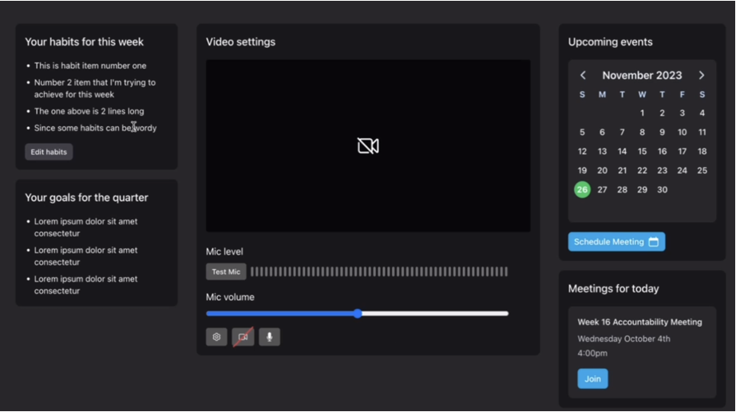
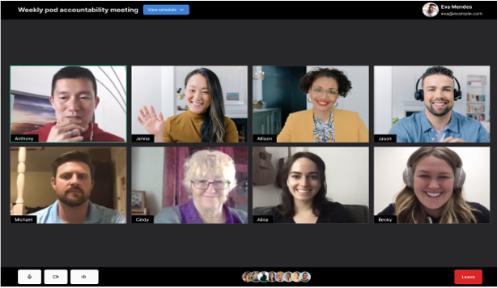

<p align="center">
  
</p>
Team Members:
- Sparsh Saini 
- Victor Severin 
- Brandon Chu 
- Daryl Denaga 
- Fabian Lopez 
- Jasjot Singh 
- Brian Lowery 
- Matt Christiansen 

# TribeMeet

A component-based **web video conferencing application** that integrates with ABetterLife's existing software infrastructure and **resolves** compatibility issues, elevates the user experience, and delivers a robust API for detailed user analytics. 
Currently, ABetterLife uses a service called AirMeet to facilitate their weekly meetings however their customers have consistently had compatibility issues with different devices, cameras, and audio outputs. As stated above our application seeks to mitigate these issues by integrating directly into BetterLife's infrastructure.

<p align="left">
  
</p>

**ABetterLife:** https://abetterlife.com/

## Technology Stack

### Frontend

- **[TailwindCSS](https://tailwindcss.com/)**: To craft a responsive and aesthetically pleasing user interface with a focus on design consistency and usability.
- **[Nuxt.js](https://nuxt.com/)**: To harness the benefits of server-side rendering for a fast, rich user interface.

#### Application Backend

- **[FaunaDB](https://fauna.com/)**: Utilizing this database for its flexibility and ease of scaling to manage user data effectively. Additionally, ABetterLife’s system is using FaunaDB, so integration will be seamless.
- **[100ms](https://www.100ms.live/docs)**: WebRTC wrapper API that facilitates all peer-to-peer video conferencing capabilities including meeting creation, video conferencing, and chat within meeting.

## ERD

<p align="center">
  
</p>

## Prototype

**UI Dashboard:**

<p align="center">
   <br>
  <h4>Shown above is the Dashboard, the central page of TribeMeet where logged-in users can:</h4>
  <ul>
    <li>Configure video & mic settings (center)</li>
    <li>Schedule/join a meeting (right column)</li>
    <li>Assess habits using habit tracker (top left)</li>
    <li>View goals for the quarter (bottom left)</li>
  </ul>

</p> <br>

**Pod Meetings:**

<p align="center">
  
  <h4>The core interface of TribeMeet where participants engage in video conferencing:</h4>
  <ul>
    <li>View all particpants' cameras in a grid layout</li>
    <li>Control your video and microphone</li>
    <li>Exit the meeting with a dedicated leave button</li>
  </ul>
</p> <br>

**Robust API**

<p align="center">
  
  <h4>The robust API of TribeMeet provides extensive control over meeting management and data retrieval. Developers can:</h4>
  <ul>
    <li>Schedule meetings with customizable settings</li>
    <li>Retrieve detailed detailed analytics on participant engagement, including attendance duration, interaction levels, and more.</li>
    <li>Integrate TribeMeet's functionality into existing workflows or applications for a unified user experience.</li>
  </ul>
</p>

## Developer Instructions

**Clone repository:**

```bash
git clone https://github.com/Team-Kaizen-Senior-Project/better-life-meet.git
```

With **[npm](https://www.npmjs.com/)** installed:

**Install dependencies and run development:**

```bash
npm install
npm run dev
```

## Testing

TribeMeet uses **[vitest](https://github.com/vitest-dev/vitest)** for testing. To install vitest, use the following commands:

```bash
cd frontend
npm install --save-dev vitest @vue/test-utils happy-dom
```

To run tests, use the following command:

```bash
npm run test
```

Any further information on testing Nuxt applications can be found here: **[Nuxt testing](https://nuxt.com/docs/getting-started/testing)**.

## Deployment

1. Create a PR and request at least 2 developers to perform code review.
2. Once the review is completed merge PR into the main branch.
3. After changes are merged to the main branch the CI/CD pipeline runs and automatically runs the test suite and deploys the site to Vercel.

## Timeline

| Sprint | Task                                                                                  | Status  | Date       |
| ------ | ------------------------------------------------------------------------------------- | ------- | ---------- |
| 1      | Foundational setup of project (repos, database, ERD, etc)                             | Done    | 10/09/2023 |
| 2      | Translation of mockup into actual frontend. Development of backend APIs               | Done    | 10/23/2023 |
| 3      | Refinement of UI and backend APIs (refactor codebases) and initial setup of MediaSoup | Done    | 11/12/2023 |
| 4      | Meeting room UI, expansion of APIs, Creation of MediaSoup server                      | Done    | 11/27/2023 |
| 5      | Integration of MediaSoup Server with Application                                      | Pending | 02/03/2024 |
| 6      | POC of podmeeting with Mediasoup                                                      | Pending | 02/15/2024 |
| 7      | Web Player                                                                            | Pending | 03/02/2024 |
| 8      | User analytics API design                                                             | Pending | 03/17/2024 |
| 9      | Implementation of API                                                                 | Pending | 04/05/2024 |
| 10     | Testing Front-End & Backend/API Compatability on Multiple Devices                     | Pending | 04/20/2024 |
| 11     | Deployment                                                                            | Pending | 05/05/2024 |
| 12     | Additional Features/Finishing Touches                                                 | Pending | 05/22/2024 |
